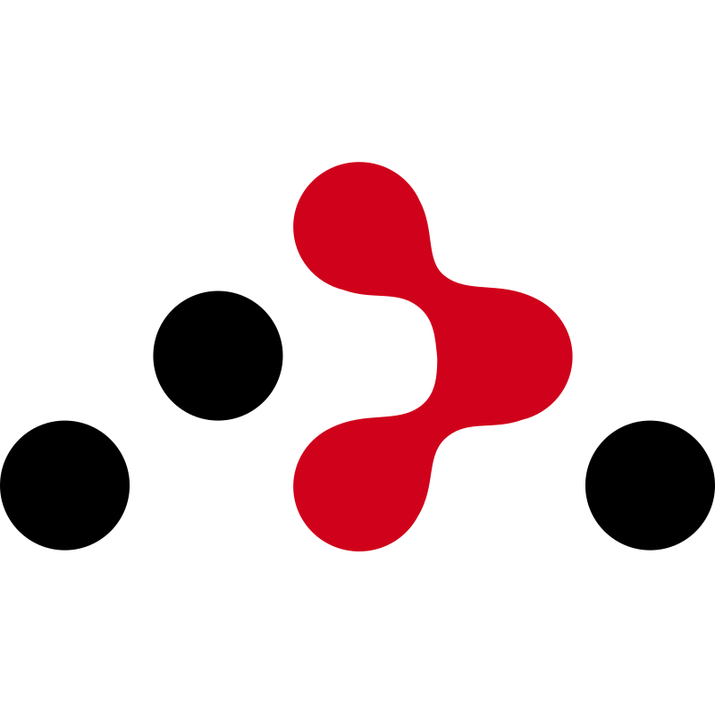
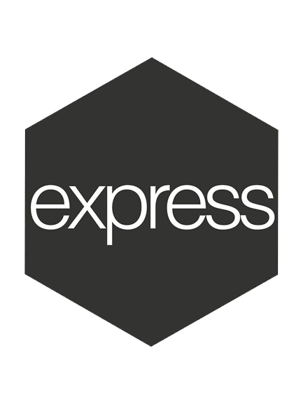
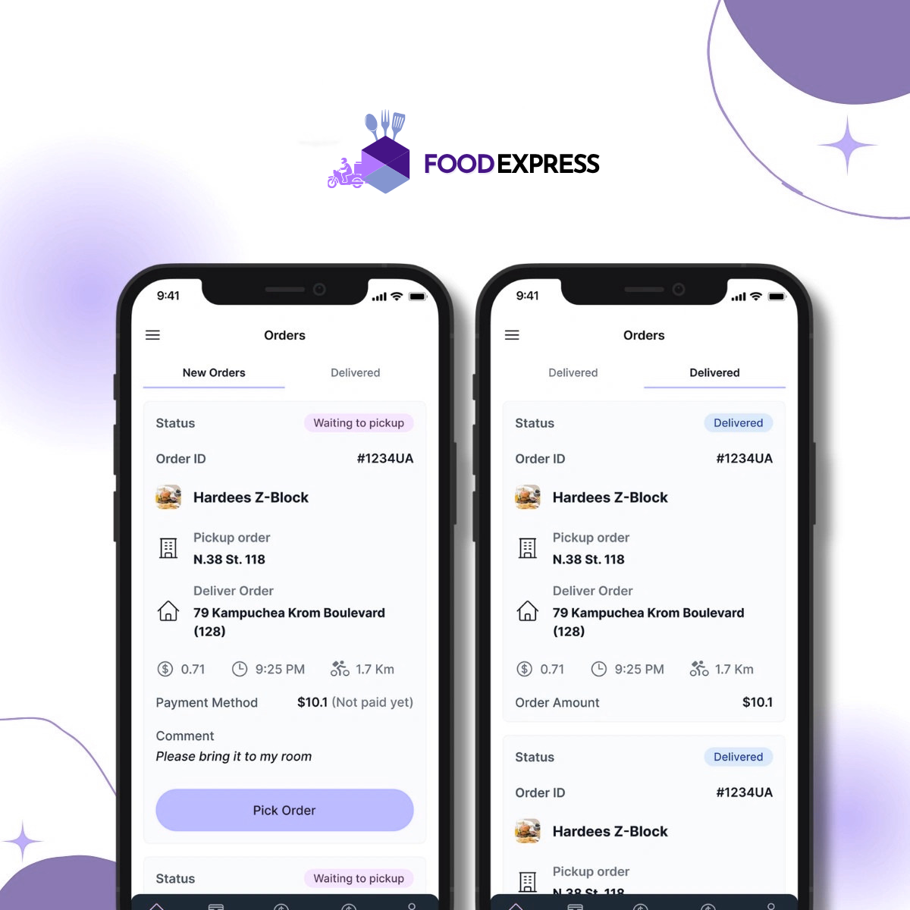
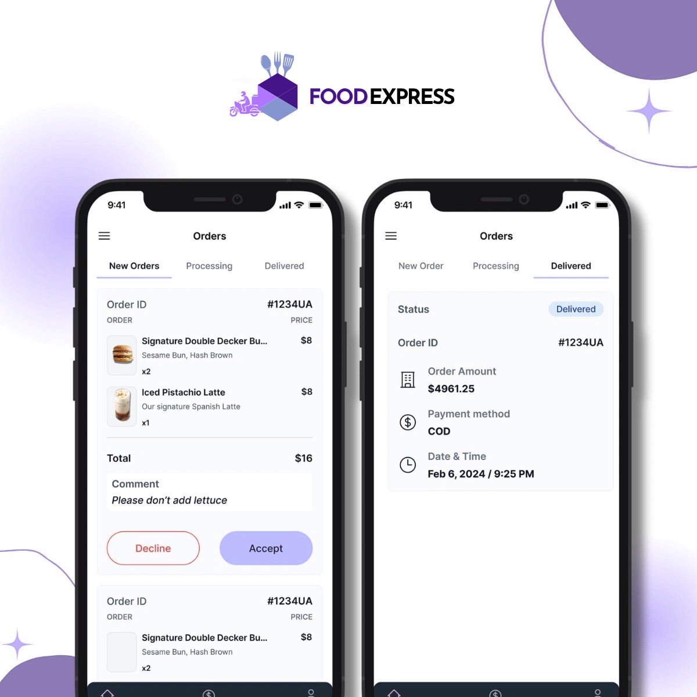
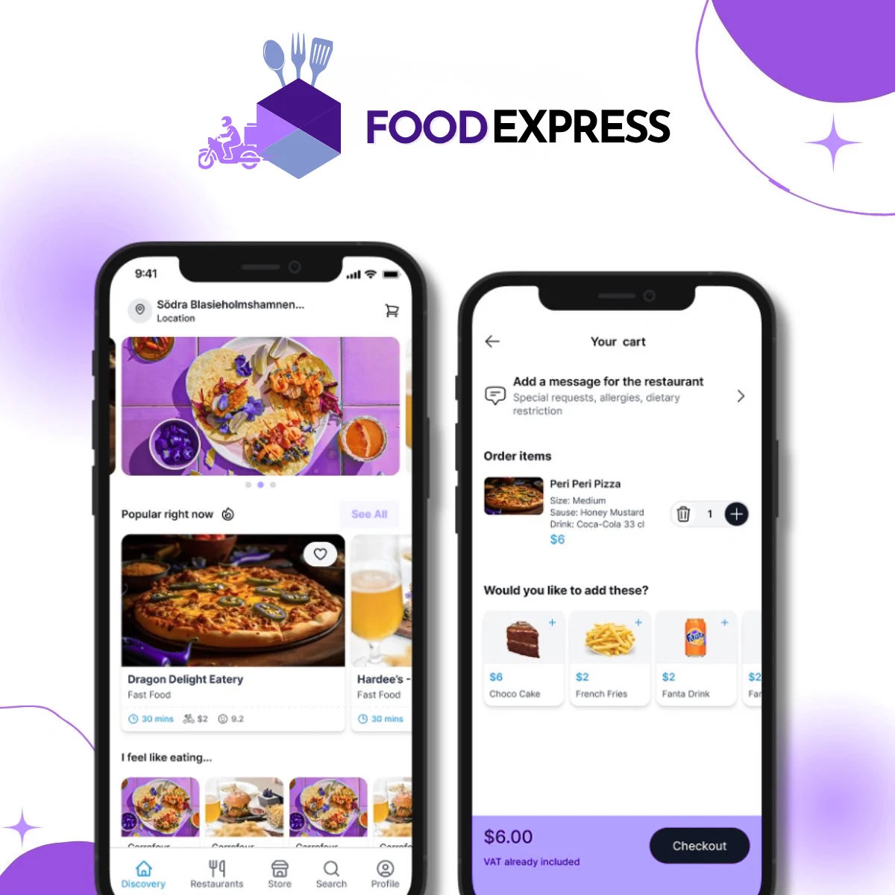
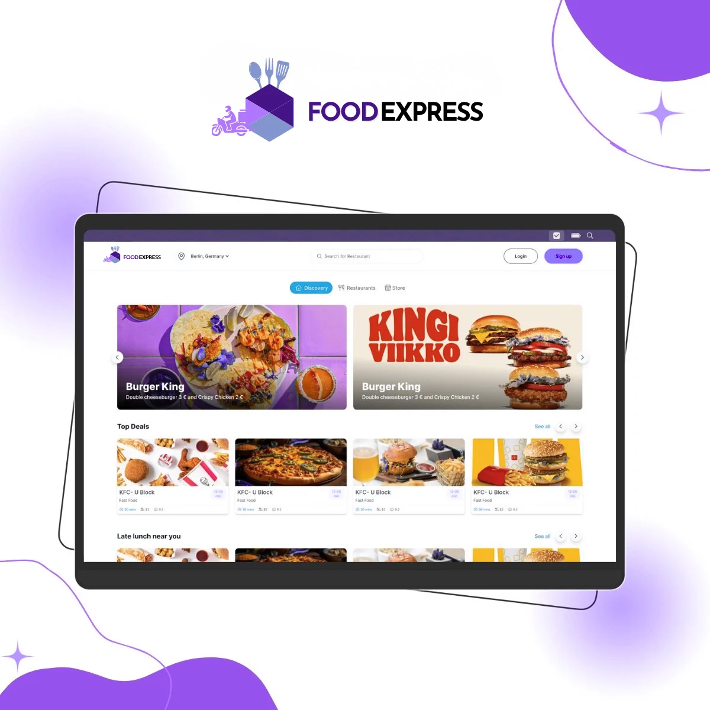
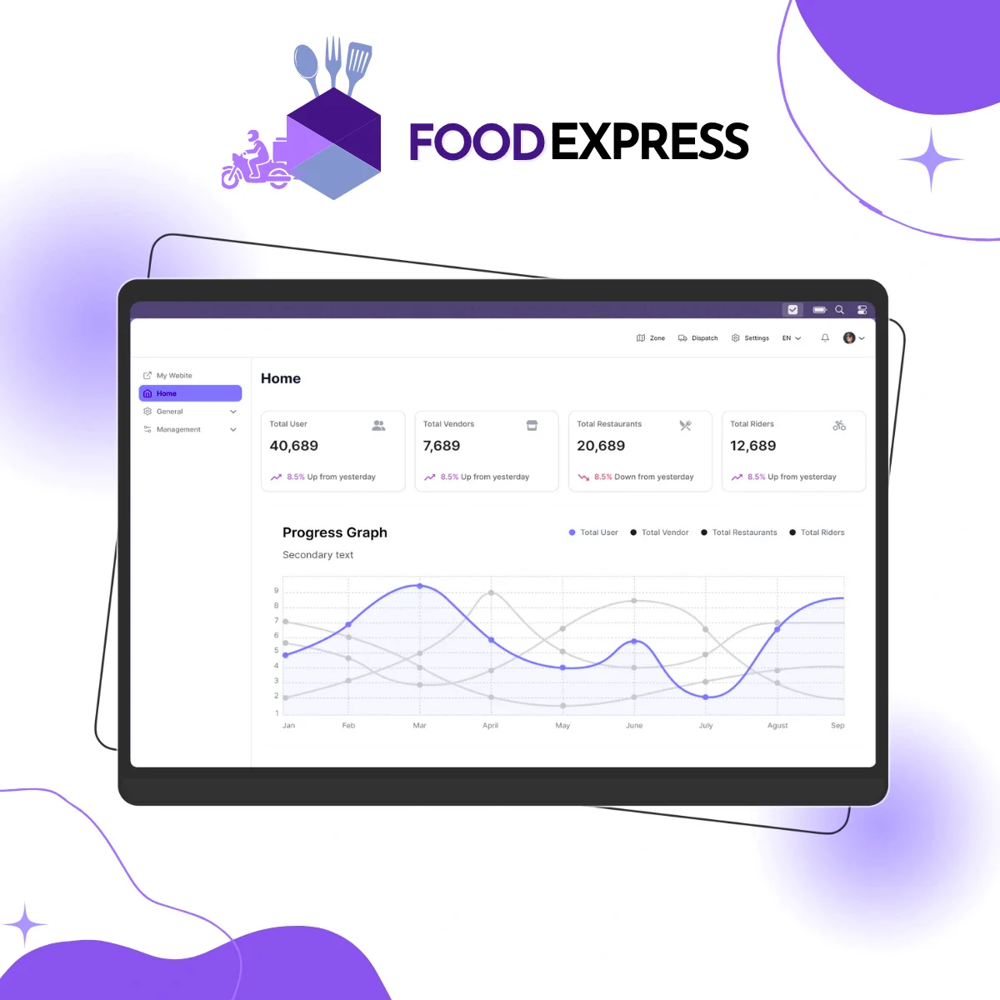
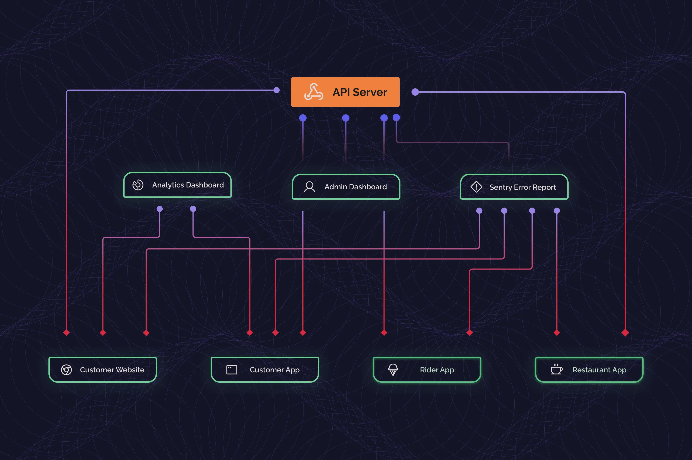
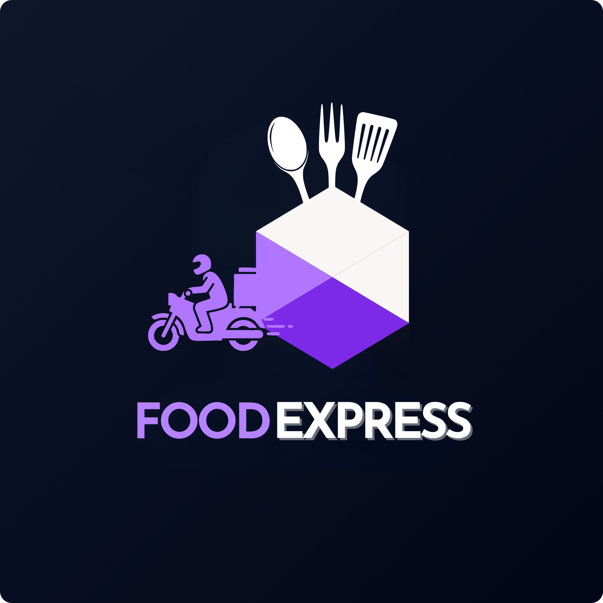
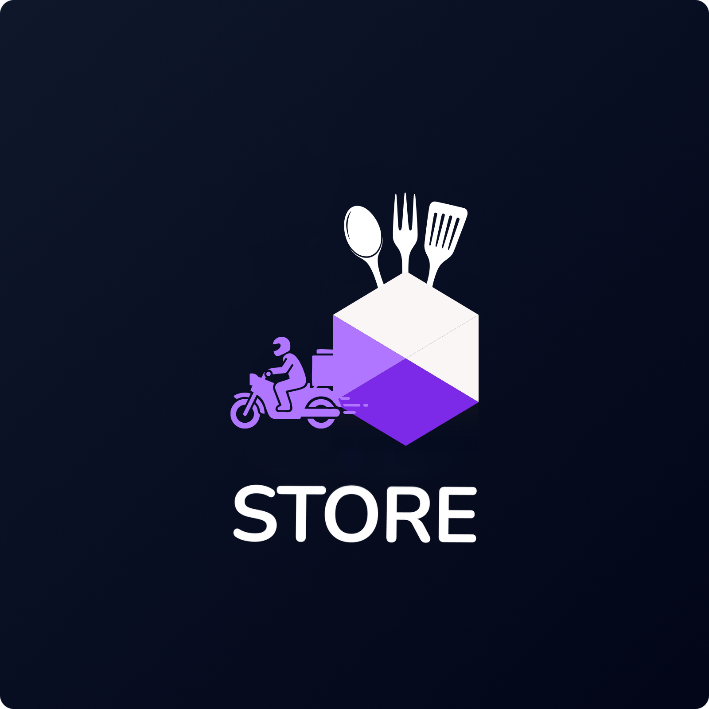

<div align="right">
<a target="_blank" href="https://www.facebook.com/" style="text-decoration:none">
  
</a>
<a target="_blank" href="https://www.linkedin.com/in/johan-sneider-espitia/" style="text-decoration:none">
  
</a>
<a target="_blank" href="https://x.com/" style="text-decoration:none">
  
</a>

</div>

<div align="center">
  <h2>FoodExpress Multi Vendor Delivery Management System</h2>
  <i>Una plataforma moderna y personalizable para gestionar pedidos en línea y logística en todas las industrias.</i>
 <br/>
<br />
</div>

<div align="center">

[](https://github.com/JohanSE17)
[](https://github.com/JohanSE17)
[](https://github.com/JohanSE17)

[](https://github.com/JohanSE17)
[](https://github.com/JohanSE17)
[](https://github.com/JohanSE17)
[](https://www.youtube.com/embed/PqV8EalcxZ0)
[](https://foodexpress.com)
[](https://github.com/JohanS117)
[](https://github.com/JohanS117)

</div>

<div align="center">

[](https://www.facebook.com/)
[](https://www.instagram.com/)
[](https://x.com/)
[](https://www.linkedin.com/in/johan-sneider-espitia/)

</div>

<div align="center">

  <iframe width="560" height="315" src="https://www.youtube.com/embed/TToPJy1kTAw&source_ve_path=MTc4NDI0" title="FoodExpress Demo Video" frameborder="0" allow="accelerometer; autoplay; clipboard-write; encrypted-media; gyroscope; picture-in-picture; web-share" allowfullscreen style="border-radius: 6px;"></iframe>

</div>

<br>

El Sistema de Gestión de Entregas Multi Vendor FoodExpress está diseñado para empresas que buscan implementar una plataforma completa y lista para usar para ejecutar sus operaciones de pedidos y logística en línea. Ya sea para entrega de alimentos o comestibles, logística de paquetes, servicios a domicilio, flores, pedidos de farmacia u otros negocios basados en entregas, FoodExpress se puede adaptar a sus necesidades.
Construido pensando en la facilidad de uso y la intuición, el sistema FoodExpress admite múltiples proveedores y múltiples regiones de servicio. Con aplicaciones separadas para clientes, proveedores y agentes de entrega, junto con un potente panel de administración, FoodExpress le permite lanzar y operar su propio ecosistema de pedidos y entregas de extremo a extremo sin tener que construir todo desde cero.

La solución es completamente de código abierto, pero el backend y la API son propietarios.


<!-- Add a horizontal rule para separación -->
<hr/>

## :fast_forward: Enlaces rápidos

- [:book: Qué está incluido](#heading-1)
- [:rocket: Características](#heading-2)
- [:wrench: Configuración](#heading-3)
- [:gear: Requisitos](#heading-4)
- [:computer: Tecnologías](#heading-5)
- [:camera: Capturas de pantalla](#heading-6)
- [:triangular_ruler: Arquitectura de Alto Nivel](#heading-7)
- [:page_with_curl: Documentación](#heading-8)
- [:movie_camera: Videos de Demostración](#heading-14)
- [:video_game: Demos](#heading-9)
- [:busts_in_silhouette: Colaboradores](#heading-10)
- [:warning: Descargo de responsabilidad](#heading-12)
- [:email: Contacto](#heading-13)
- [:computer: Guía de Configuración del Proyecto](#heading-15)

<!-- Add a horizontal rule para separación -->
<hr/>

## :question: ¿Qué está incluido?: <a id="heading-1"></a>

FoodExpress proporciona un conjunto completo de componentes de software, que incluyen:

- Aplicación de Cliente Multi Vendor FoodExpress
- Aplicación de Repartidor/Conductor Multi Vendor FoodExpress
- Aplicación de Proveedor/Tienda Multi Vendor FoodExpress
- Sitio Web de Pedidos para Clientes
- Panel de Administración Web
- Servidor API
- Panel de Análisis usando Expo Amplitude
- Monitoreo y reporte de errores con Sentry

## :fire: Características: <a id="heading-2"></a>

- Autenticación usando Google, Apple y Facebook
- Secciones dinámicas del hogar para resaltar los principales proveedores y servicios
- Notificaciones push y alertas por correo electrónico para la creación de cuentas, actualizaciones de pedidos y progreso de la entrega
- Seguimiento en tiempo real de los agentes de entrega y chat en la aplicación
- Verificación de correo electrónico y número de teléfono
- Descubrimiento de proveedores basado en la ubicación en Mapas y Pantalla de Inicio
- Soporte multi-idioma y temas personalizables
- Calificaciones y reseñas para pedidos y experiencias de servicio
- Detalles del proveedor/servicio que incluyen calificaciones, horarios, plazos de entrega, ofertas, ubicación, pedido mínimo o monto del servicio, y más
- Integraciones de pago incluyendo PayPal y Stripe
- Historial de pedidos y reservas con la capacidad de marcar proveedores favoritos
- Gestión de direcciones con sugerencias de Google Places e integración con Mapas
- Análisis y reporte de errores con Amplitude y Sentry
- Soporte para variaciones de artículos/servicios, notas, modos de recogida y entrega, y opciones de tiempo personalizables


## :repeat_one: Configuración: <a id="heading-3"></a>

Como mencionamos anteriormente, la solución incluye cinco módulos separados. Para configurar estos módulos, siga los pasos a continuación:

Para ejecutar el módulo, debe tener nodejs instalado en su máquina. Una vez que nodejs esté instalado, vaya al directorio e ingrese los siguientes comandos

Las credenciales y claves requeridas ya han sido configuradas. Puede configurar sus propias claves y credenciales

La versión de nodejs debe estar entre 18 y 20 (con 16 como versión menor y 0 como parche)

[](https://foodexpress.com/multi-vendor-doc/)

## :information_source: Requisitos: <a id="heading-4"></a>

IDs de Aplicación para la App Móvil en `app.json`

- Facebook Scheme
- Facebook App Id
- Facebook Display Name
- iOS Client Id Google
- Android Id Google
- Amplitude Api Key
- server url

Establecer credenciales en API en el archivo helpers/config.js y helpers/credentials.js

- Email User Name
- Password For Email
- Mongo User
- Mongo Password
- Mongo DB Name
- Reset Password Link
- Admin User name
- Admin Password
- User Id
- Name

Establecer credenciales en Admin Dashboard en el archivo src/index.js

- Firebase Api Key
- Auth Domain
- Database Url
- Project Id
- Storage Buck
- Messaging Sender Id
- App Id

NOTA: El proveedor de correo electrónico solo ha sido probado para cuentas de Gmail

## :hammer_and_wrench: Tecnologías: <a id="heading-5"></a>

|                                               Expo                                                |                                                   React-Navigation                                                   |                                                Apollo GraphQL                                                |                                               ReactJS                                                |                                                NodeJS                                                 |                                                 MongoDB                                                 |                                                   Firebase                                                   |
| :-----------------------------------------------------------------------------------------------: | :------------------------------------------------------------------------------------------------------------------: | :----------------------------------------------------------------------------------------------------------: | :--------------------------------------------------------------------------------------------------: | :---------------------------------------------------------------------------------------------------: | :-----------------------------------------------------------------------------------------------------: | :----------------------------------------------------------------------------------------------------------: |
| <a href="https://expo.dev/"></a> | <a href="https://reactnavigation.org/"></a> | <a href="https://www.apollographql.com/"></a> | <a href="https://reactjs.org/"></a> | <a href="https://nodejs.org/en/"></a> | <a href="https://www.mongodb.com/"></a> | <a href="https://firebase.google.com/"></a> |

|                                                 React Native                                                 |                                                       React Router                                                       |                                                GraphQL                                                |                                                ExpressJS                                                 |                                                   React Strap                                                    |                                                Amplitude                                                |
| :----------------------------------------------------------------------------------------------------------: | :----------------------------------------------------------------------------------------------------------------------: | :---------------------------------------------------------------------------------------------------: | :------------------------------------------------------------------------------------------------------: | :--------------------------------------------------------------------------------------------------------------: | :-----------------------------------------------------------------------------------------------------: |
| <a href="https://reactnative.dev/"></a> | <a href="https://reactrouter.com/"></a> | <a href="https://graphql.org/"></a> | <a href="https://expressjs.com/"></a> | <a href="https://reactstrap.github.io/"></a> | <a href="https://amplitude.com/"></a> |

## :framed_picture: Capturas de pantalla: <a id="heading-6"></a>

|          Rider App           |
| :--------------------------: |
|  |

|               Store APP               |
| :----------------------------------------: |
|  |

|          Customer App           |
| :-----------------------------: |
|  |

|           Customer Web            |
| :-------------------------------: |
|  |

|             Dashboard              |
| :--------------------------------: |
|  |

## :wrench: Arquitectura de Alto Nivel: <a id="heading-7"></a>



## :book: Documentación <a id="heading-8"></a>

Encuentra el enlace para la documentación completa de la Solución Multi Vendor de FoodExpress [aquí](https://foodexpress.com/multivendor-documentation/).

## :tv: Demo Videos: <a id="heading-14"></a>

|                                               Demo del Panel de Administración                                               |                                                 Demo de la Aplicación Móvil                                                  |
| :--------------------------------------------------------------------------------------------------------------: | :--------------------------------------------------------------------------------------------------------------: |
| <iframe width="200" height="113" src="https://www.youtube.com/embed/Gb5DZWt_7Yw" title="Admin Dashboard Demo" frameborder="0" allow="accelerometer; autoplay; clipboard-write; encrypted-media; gyroscope; picture-in-picture; web-share" allowfullscreen></iframe> | <iframe width="200" height="113" src="https://www.youtube.com/embed/DR4Vuu_VSZA?list=PL5jb9EteFAOAusKTSuJ5eRl1BapQmMDT6" title="Mobile App Demo" frameborder="0" allow="accelerometer; autoplay; clipboard-write; encrypted-media; gyroscope; picture-in-picture; web-share" allowfullscreen></iframe> |

## :iphone: Demos: <a id="heading-9"></a>

|                                                                                                                                               Aplicación del Cliente                                                                                                                                                |                                                                                                                                                   Aplicación del Repartidor                                                                                                                                                    |                                                                                                                                                       Aplicación de la Tienda                                                                                                                                                        |                                                   Web del Cliente                                                   |                                                    Panel de Administración                                                     |
| :-------------------------------------------------------------------------------------------------------------------------------------------------------------------------------------------------------------------------------------------------------------------------------------------------------: | :------------------------------------------------------------------------------------------------------------------------------------------------------------------------------------------------------------------------------------------------------------------------------------------------------------: | :-------------------------------------------------------------------------------------------------------------------------------------------------------------------------------------------------------------------------------------------------------------------------------------------------------------------------: | :--------------------------------------------------------------------------------------------------------------: | :--------------------------------------------------------------------------------------------------------------------: |
|                                                                                          <a href="#heading-9" style="pointer-events: none;"></a>                                                                                           |                                                                                          <a href="#heading-9" style="pointer-events: none;"></a>                                                                                          |                                                                                            <a href="#heading-9" style="pointer-events: none;"></a>                                                                                            | <a href="http://multivendor.foodexpress.com/"></a> | <a href="http://multivendor-admin.foodexpress.com/"></a> |
| <a href="https://play.google.com/store/apps/details?id=com.foodexpress.multivendor"></a> <a href="https://apps.apple.com/pk/app/foodexpress-multivendor/id1526488093"></a> | <a href="https://play.google.com/store/apps/details?id=com.foodexpress.multirider"></a> <a href="https://apps.apple.com/pk/app/foodexpress-mulitvendor-rider/id1526674511"></a> | <a href="https://play.google.com/store/apps/details?id=multivendor.foodexpress.restaurant"></a> <a href="https://apps.apple.com/pk/app/foodexpress-multivendor-restaurant/id1526672537"></a> |

## :people_holding_hands: Colaboradores: <a id="heading-10"></a>

<div align="center">
<br>
<a href="https://github.com/JohanSE17">
  
</a>
</div>

## :warning: Descargo de responsabilidad: <a id="heading-12"></a>

El código fuente del frontend para nuestra solución es completamente de código abierto. Sin embargo, la API y el backend son propietarios y se puede acceder a ellos mediante una licencia de pago. Para obtener más información, contáctenos a través de los canales proporcionados a continuación.

## :mailbox_with_mail: Contáctenos: <a id="heading-13"></a>

[Observa los Product Page y Pricing and more for FoodExpress Multivendor Food Delivery Solution](https://foodexpress.com/?utm_source=github&utm_medium=referral&utm_campaign=github_guide&utm_id=12345678)

## :computer: Guía de Configuración del Proyecto <a id="heading-15"></a>

Esta sección proporciona instrucciones detalladas para configurar y ejecutar cada componente de la Solución de Entrega de Comida Multi Vendor de FoodExpress.

### FoodExpress Admin Dashboard (Next.js)

El panel de administración le permite gestionar restaurantes, pedidos, repartidores y más.

```bash
# Navegar al directorio del panel de administración
cd foodexpress-multivendor-admin

# Install dependencies
npm install

# Start the development server
npm run dev
```

Después de ejecutar estos comandos, abra su navegador y navegue a [http://localhost:3000](http://localhost:3000) para acceder al panel de administración. También puede hacer clic en CTRL+clic en el enlace localhost que aparece en su terminal.

### FoodExpress Customer Web (React.js)

La aplicación web del cliente permite a los usuarios navegar por los restaurantes y realizar pedidos a través de un navegador web.

```bash
# Navegar al directorio web del cliente
cd foodexpress-multivendor-web

# Install dependencies
npm install

# Start the development server
npm start
```

Después de ejecutar estos comandos, la aplicación estará disponible en [http://localhost:3000](http://localhost:3000) en su navegador web.

### FoodExpress Customer App (React Native)

La aplicación móvil del cliente permite a los usuarios navegar por los restaurantes y realizar pedidos en sus dispositivos móviles.

```bash
# Navegar al directorio de la aplicación del cliente
cd foodexpress-multivendor-app

# Install dependencies
npm install

# Start the Expo development server
npx expo start -c
# OR
npm start -c
```

#### Prueba en un dispositivo físico con Expo Go

1. Presione `s` en la terminal para cambiar al modo Expo Go
2. Escanee el código QR que se muestra en la terminal:
   - Android: Abra la aplicación Expo Go y escanee el código QR
   - iOS: Use la cámara del dispositivo para escanear el código QR

### FoodExpress Rider App (React Native)

La aplicación del repartidor permite al personal de entrega gestionar y completar las entregas.

```bash
# Navegar al directorio de la aplicación del repartidor
cd foodexpress-multivendor-rider

# Install dependencies
npm install

# Start the Expo development server
npx expo start -c
# OR
npm start -c
```

#### Prueba en un dispositivo físico con Expo Go

1. Presione `s` en la terminal para cambiar al modo Expo Go
2. Escanee el código QR que se muestra en la terminal:
   - Android: Abra la aplicación Expo Go y escanee el código QR
   - iOS: Use la cámara del dispositivo para escanear el código QR

### FoodExpress Restaurant App (React Native)

La aplicación del restaurante permite a los propietarios de restaurantes gestionar los pedidos y su menú.

```bash
# Navegar al directorio de la aplicación del restaurante
cd foodexpress-multivendor-restaurant

# Install dependencies
npm install

# Start the Expo development server
npx expo start -c
# OR
npm start -c
```

#### Prueba en un dispositivo físico con Expo Go

1. Presione `s` en la terminal para cambiar al modo Expo Go
2. Escanee el código QR que se muestra en la terminal:
   - Android: Abra la aplicación Expo Go y escanee el código QR
   - iOS: Use la cámara del dispositivo para escanear el código QR

### Construcción de versiones de desarrollo

Para todas las aplicaciones móviles (Cliente, Repartidor y Restaurante), puede crear versiones de desarrollo utilizando EAS Build.

#### Configurar EAS Build

```bash
# From the app directory (customer, rider, or restaurant)
eas build:configure
```

Seleccione la plataforma deseada:
- android
- ios
- all

#### Build for Android

```bash
eas build --platform android --profile development
```

Esto creará un archivo APK que puede instalar directamente en su dispositivo Android.

#### Build for iOS

```bash
eas build --platform ios --profile development
```

Para las compilaciones del simulador de iOS, modifique el archivo `eas.json` para incluir:

```json
"development": {
  "developmentClient": true,
  "distribution": "internal",
  "channel": "development",
  "ios": {
    "simulator": true
  },
  "android": {
    "buildType": "apk"
  }
}
```

Luego ejecute:

```bash
eas build --platform ios --profile development
```
